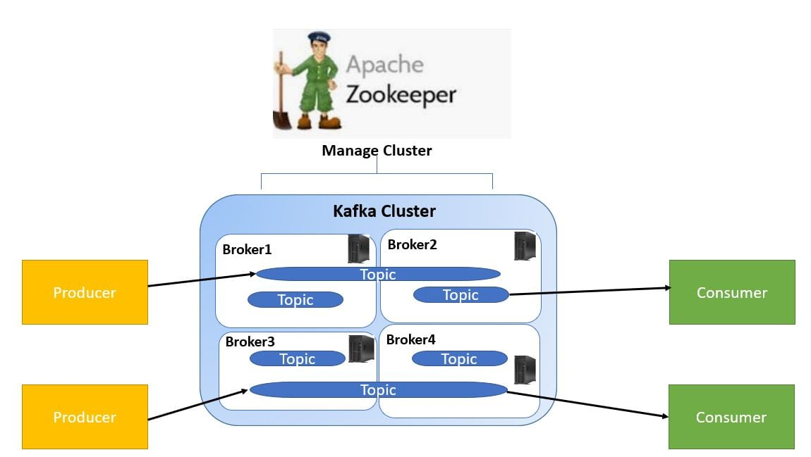

# Kafka Data Engineering Project

## Introduction 
This repo is modified from original [repo](https://github.com/darshilparmar/stock-market-kafka-data-engineering-project), to simulate real-time data processing capabilities of Kafka.

Technologies used: Amazon Web Services (AWS), Apache Kafka, Glue, Athena, and SQL.

## Architecture 

## Technology Used
- Programming Language - Python
- Amazon Web Service (AWS)
1. S3 (Simple Storage Service)
2. Athena
3. Glue Crawler
4. Glue Catalog
5. Apache Kafka (On EC2 Instance)

## On Kafka

## Instructions
1. Create EC2 instance with user data in `setup.sh`.
2. Zookeeper is used to track cluster state, membership, and leadership. To start zookeeper, run `bin/zookeeper-server-start.sh config/zookeeper.properties`.
2. To start Kafka server, ssh into EC2 instance, and run command `bin/kafka-server-start.sh config/server.properties`.
3. Use another terminal to create topic `bin/kafka-topics.sh --create --topic kafka_demo --bootstrap-server {EC2_Public_IP}:9092 --replication-factor 1 --partitions 1`.
4. Create S3 bucket.
5. Run command `python3 kafka_consumer.py` to start listening for events.
6. Run command `python3 kafka_producer.py` to start generating random events.
7. Observe S3 bucket filling up. 
8. Use Glue metadata crawlers to crawl for data in S3 bucket.
9. Analyze data in Athena.